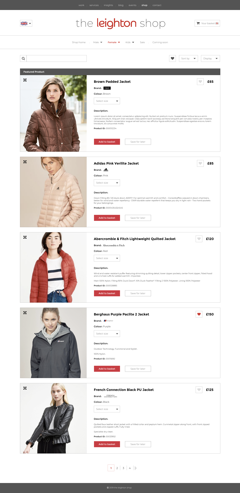

# Supping Page Example

this is a one page application replicating a shopping page, this was actually given to me as a test project for [leighton](https://www.leighton.com/) for a position I was applying for.

I opted to do the test in React and you can see my example live [here](https://amazing-mirzakhani-486d14.netlify.com/), it is styled with **Tachyons**, which I enjoyed using for the most part, but I choose it most of all just to try something different.

Obviously not everything on the site works in terms of nav buttons, pagination etc, it is just there for effect and to replicate design.

## Instructions

Here are the instructions I was given:

#### User Story

As a: customer accessing the products page

I want: to be able to access a fully responsive page that displays all the products that has available stock

So that: I could potentially purchase a product on any device.

_The developer has creative license to use any technologies they want in order to build the application along with design control as long as it is inline with the acceptance criteria._

#### Acceptance Criteria

- application must use the API outlined in the technical specification for the data

- api key must be passed through requester headers

- the page should replicate a real page, including a standard header, footer and Leighton brand name.

- page must be responsive

- each product should be displayed separately

- a product must display the productId, name, brand, colour, description, sizes and a buy button.

- a featured product should be made prominent at the top of the page and not repeated.

- products should only be shown where stock is available

- products with stock should only show options for the sizes where stock is available

- placeholder images are used for product thumbnails

- content must be accessible

- codebase must be made available on a GIT repository

#### Technical Specification

- api endpoint: XXXXXXXXX

- api token key: XXXXXXXXX

- api token value: XXXXXXXXX

- api param key: TableName

- api param value: products

- featured product id: XXXXXXXXX

#### Optional/Desirable

- MVC structure

- Unit tested

- CSS preprocessor (SASS)

- angular/typescript

The purpose of this exercise is to show off your skills, go as far as you want to show you know your stuff. Learn something new, try a different language, let your curiosity inspire you.

If you are attempting a language for the first time for the purpose of this test to impress us, let us know as it will help us gauge how you learn and apply those learnings.

An example design has been provided for you, as we aren’t expecting a Software Engineer to be a design expert, so feel free to be creative and follow your own design or alternatively match the design provided as much as possible.

#### Example Design

## Future Work

I would like to go back and change a couple of things within the code as well as ad some more features, but for now it will remain as I submitted it for the assessment.
